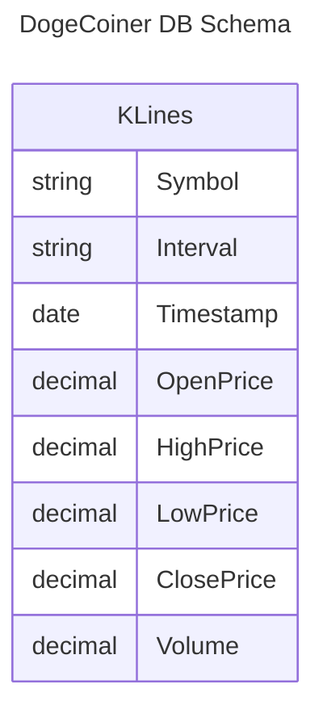

This is the database that stores crypto price history and user portfolios.

# Entity Definition

## KLines
This table contains full historical K-Line data for different assets at multiple timeframes.

K-Line is another name for candlestick. In trading, a candlestick represents a timespan and contains multiple prices including volume information.

> [!TIP]
> For candlestick charting, all this data gets used.
>
> Price charts and porfolio charts are mainly line graphs.
>
> So, when displaying this data as line graphs, the standard is to use only the **close price**.