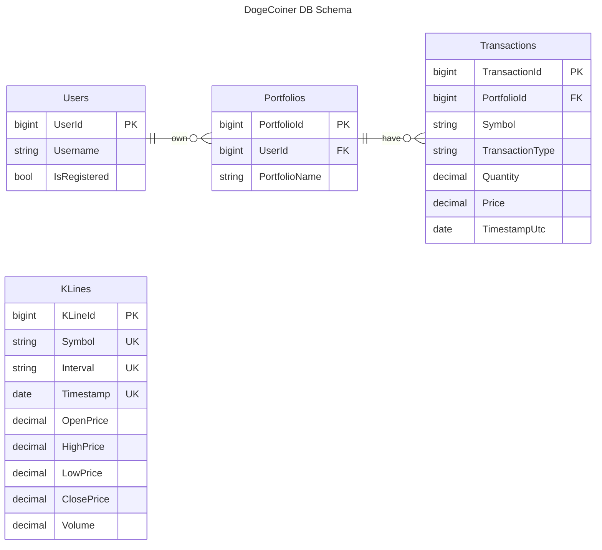
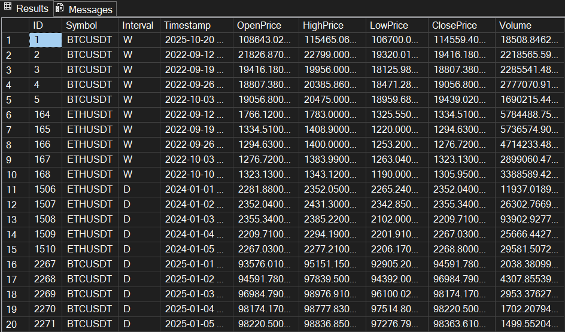

This is the database that stores crypto price history and user portfolios.

## Getting Started

This database was created as a Visual Studio Sql Database Project.

To set it up,

- install Sql Server Express default instance
- create a new database `dcoinerio`
- open the Visual Studio solution
- publish the dogecoiner-db project to your database instance

I prefer database-first DB design. With this approach, schema updates can be published from VS directly or as `dacpac` builds for CI/CD deployment.

## DB Schema

### Entity Definitions

#### Users
This table contains users.

#### Portfolios
This table contains portfolios.

#### Transactions
This table contains portfolio transactions.

#### KLines
This table contains full historical K-Line data for different assets at multiple timeframes.

K-Line is another name for candlestick. In trading, a candlestick represents a timespan and contains multiple prices including volume information.

> [!TIP]
> For candlestick charting, all this data gets used.
>
> Price charts and porfolio charts are mainly line graphs.
>
> So, when displaying this data as line graphs, the standard is to use only the **close price**.